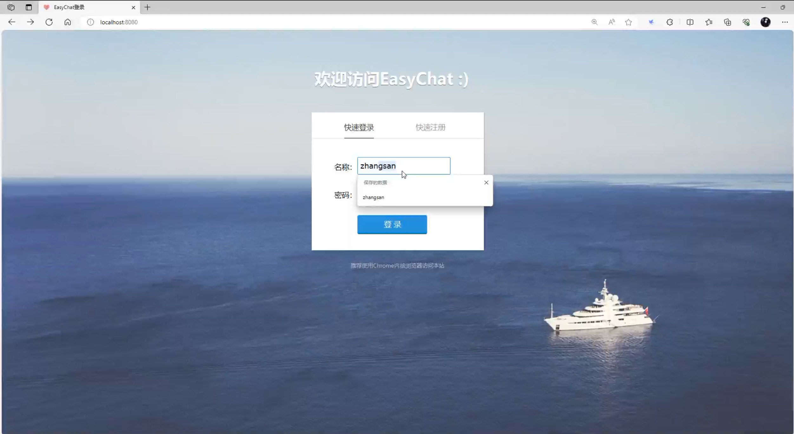
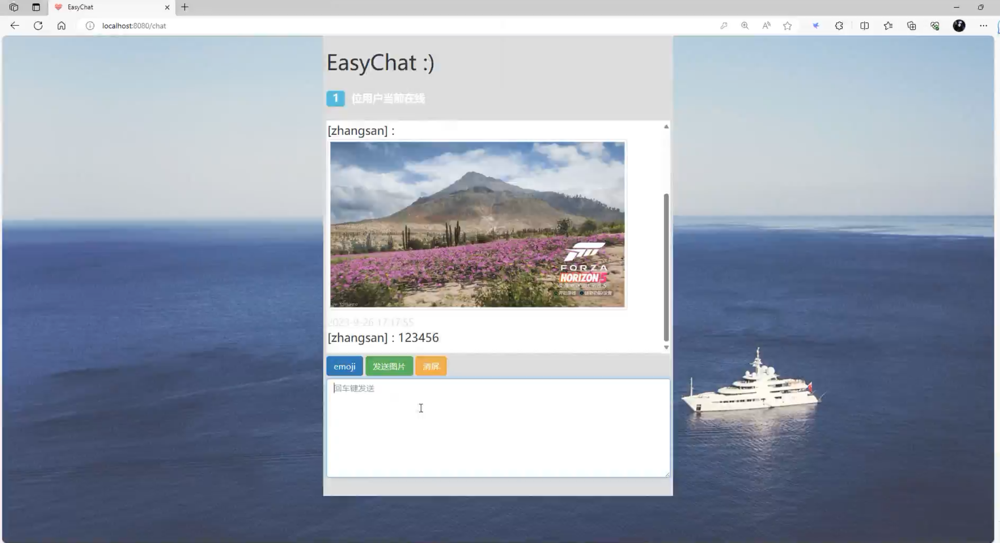
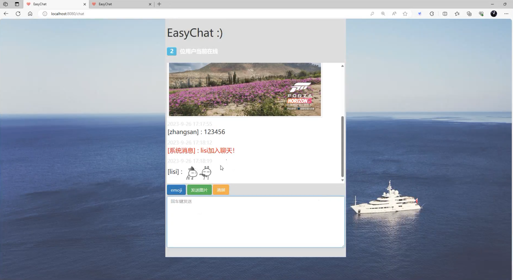

## 基于SSM+Websocket的实时在线聊天室系统

###  获取sql数据库文件: 从戎源码网 (https://armycodes.com/) QQ: 386869957 QQ群: 377586148
###  所有系统地址: (https://github.com/YuLin-Coder/AllProjectCatalog) 
###  所有项目以及源代码本人均调试运行无问题 可支持远程安装部署调试、定制修改、代码讲解

## 项目介绍
基于SSM+Websocket的实时在线聊天室系统，主要功能如下
1. 用户注册登录：用户可以通过注册账号并登录系统，以便参与在线聊天。
2. 实时聊天：用户可以在房间中实时发送文本消息，与当前在线的其他用户进行实时聊天。
3. 聊天记录：系统会自动记录聊天内容，用户可以查看聊天历史记录。
3. 发送图片和文件：用户可以发送图片和文件给其他用户，进行分享和交流。
4. 在线用户列表：用户可以查看当前房间中的在线用户列表，方便与其他用户进行交流。
5. 个人资料设置：用户可以编辑个人资料，包括昵称、头像等。
6. 消息提醒：系统会提醒用户有新消息到达，保证用户及时获取聊天信息。

## 项目技术
- 编程语言：Java
- 数据库：MySQL
- 前端技术：JSP、Websocket
- 后端技术：Spring、SpringMVC、MyBatis

## 运行环境
- JDK版本：JDK1.8及以上
- 开发工具：IDEA、Ecplise、Myecplise都可以
- 数据库: MySQL5.7及以上

## 运行截图

